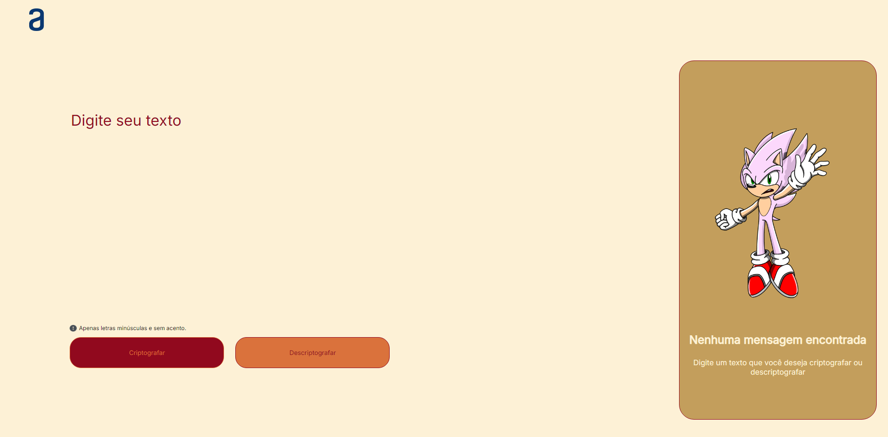



# Projeto Challenge Encriptação e Decriptação

 > ℹ️ **NOTE:** Este é um repositório desenvolvido durante os meus estudos da formação Front End T6 - Especialização do programa [ONE](https://www.oracle.com/br/education/oracle-next-education/) e na plataforma da [ALURA](https://www.alura.com.br/)

## ✨ Features
✅ Bem vindos! Este é um projeto de encriptação e decriptação de palavras e textos utilizando HTML, CSS e Javascript. Você poderá trocar mensagens secretas com outras pessoas que saibam o segredo da criptografia utilizada. 
O projeto está responsivo para dispositivos tablets e celulares.
Minha gratidão a Deus, Oracle e Alura pela oportunidade.

As "chaves" de criptografia utilizadas são:
A letra "e" é convertida para "enter"
A letra "i" é convertida para "imes"
A letra "a" é convertida para "ai"
A letra "o" é convertida para "ober"
A letra "u" é convertida para "ufat"

Por exemplo:
"gato" => "gaitober"
gaitober" => "gato"

Desafio:

Descubra qual é a nossa mensagem secreta!

"pairaibenterns poberr enterncairair enterssenter dentersaifimesober enter tenterr fimesnailimeszaidober enterlenter coberm sufatcenterssober!"

✅ Welcome! This project focuses on the encryption and decryption of words and texts using HTML, CSS and JavaScript. You can exchange secret messages with others who know the encryption key used. The project is responsive for tablets and mobile devices. My gratitude goes to God, Oracle and Alura for the opportunity. 

The encryption "keys" used are:
The letter "e" is converted to "enter."
The letter "i" is converted to "imes."
The letter "a" is converted to "ai."
The letter "o" is converted to "ober."
The letter "u" is converted to "ufat."

For example:
"gato" => "gaitober"
gaitober" => "gato" 

Challenge: 

Discover what our secret message is!

"pairaibenterns poberr enterncairair enterssenter dentersaifimesober enter tenterr fimesnailimeszaidober enterlenter coberm sufatcenterssober!"

<a href="https://projeto-challenge-one-iniciante-em-programacao.vercel.app/"> 📟 Clique aqui para visualizar a aplicação pelo Vercel</a> 
<a href="https://victorsamuraiwol.github.io/Projeto-Challenge-ONE--Iniciante-em-Programacao/"> 📟 Clique aqui para visualizar a aplicação pelo Github Pages</a> 
<a href="https://github.com/VictorSamuraiWol/Projeto-Challenge-ONE--Iniciante-em-Programacao" title="View Repository now"> 📜 Clique aqui para visualizar o reposiório</a>

## 💻 Tecnologias utilizadas no projeto

- [Trello](https://trello.com/) 
- [Figma](https://www.figma.com/)
- [Visual Studio Code](https://code.visualstudio.com/)
- [HTML](https://html.com/) 
- [CSS](https://www.w3.org/Style/CSS/Overview.en.html)
- [JavaScript](https://www.javascript.com/)
- [Github](https://github.com/)
- [Vercel](https://vercel.com/)

## 👨‍💻 Estudante Front End e AWS Cloud Computing

    
    
&nbsp&nbsp&nbspVictor Cardoso 
    &nbsp&nbsp&nbsp
    <a 
        href="https://github.com/VictorSamuraiWol">
        GitHub
    </a>
    &nbsp;|&nbsp;
    <a 
        href="https://www.linkedin.com/in/victor-cardoso-cloud-front/">
        LinkedIn
    </a>
    &nbsp;|&nbsp;
    

  

---

⌨️ com 💚 por [Victor Cardoso](https://github.com/VictorSamuraiWol)